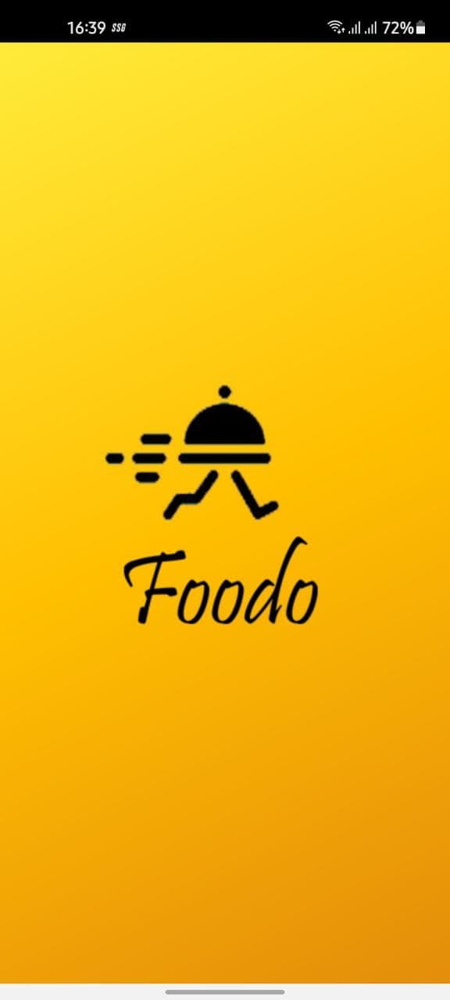
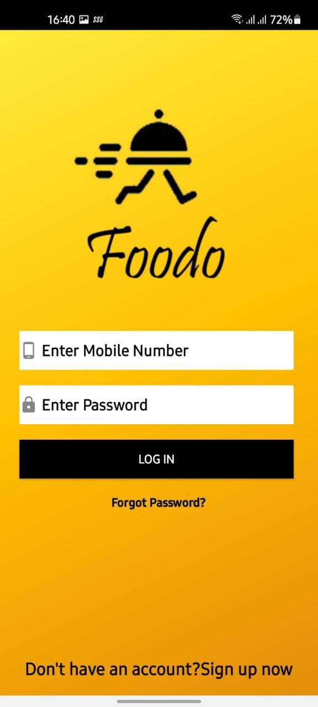
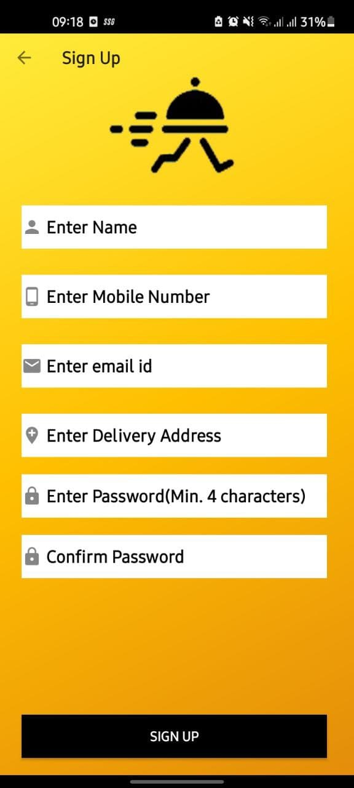
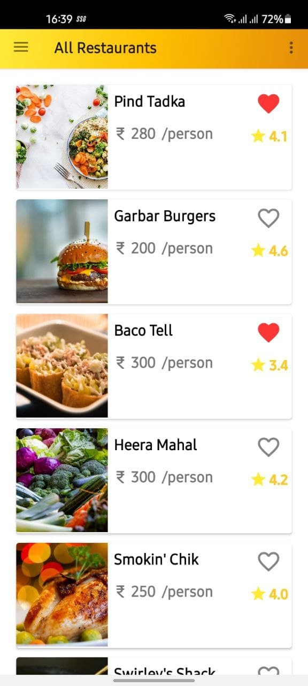
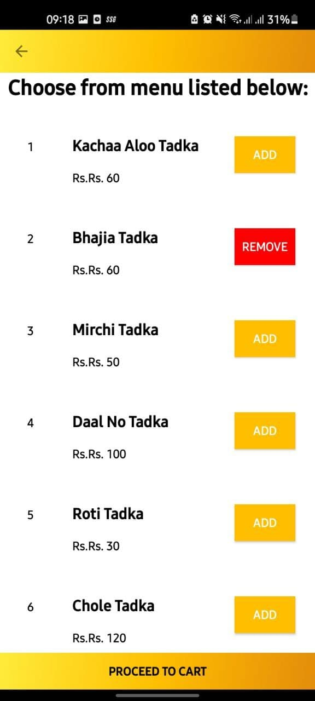
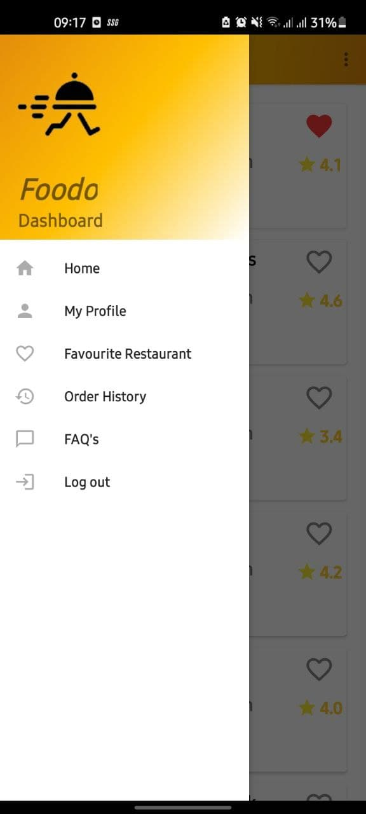
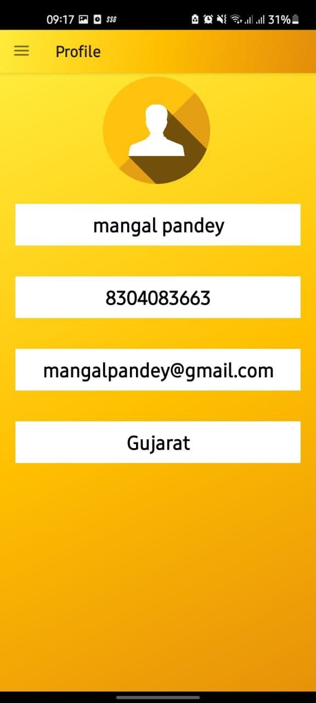
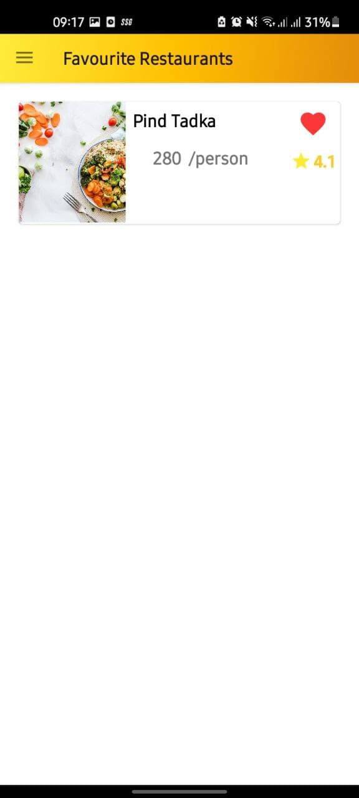
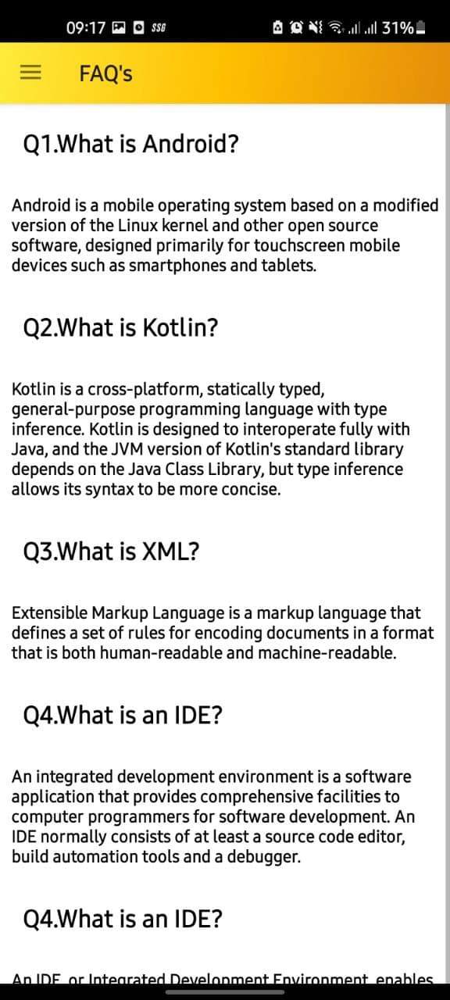

# Foodo-Food-Delivery-App

An android food ordering app created as part of Internshala App-o-thon. The app was developed based ont the API provided by Internshala. A unique API token was also provided by Internshala.

The task was to build a food ordering app that lists the restaurants and their menu items. Using that app, the users can order food
items. Further, the users can also save the restaurants as favourites and view their order history. The app will be built
using XML and Kotlin.

## UI Screenshots

